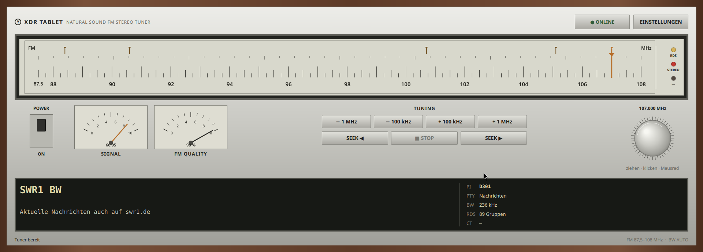

# XDR Tablet – Prototyp

Qt-Quick-Client für einen xdrd-kompatiblen TCP-Server. Die Anwendung verbindet
sich direkt mit dem ESP32/xdrd und benötigt keine WebSocket-Brücke.
# XdrTablet

Plattformübergreifender TCP-Client/USB für einen XDR-kompatiblen FM-Tuner.

## Oberfläche



## Enthalten

- xdrd-Anmeldung mit SHA-1 aus Salt und Passwort
- letzte bestätigte FM-Frequenz speichern und beim nächsten Start wiederherstellen
- Frequenzschritte von 100 kHz und 1 MHz
- Signalwert aus `S...`-Telegrammen
- CCI und ACI als Prozentwerte
- Stereo, Mono und erzwungenes Mono unterscheiden
- aktuelle dynamische Bandbreite anzeigen
- Mono-Automatik und manuelle Bandbreite steuern
- DX-Scan-Befehl senden

## Debian 13 bauen

```bash
sudo apt install build-essential cmake ninja-build \
  qt6-base-dev qt6-declarative-dev qml6-module-qtquick \
  qml6-module-qtquick-controls qml6-module-qtquick-layouts \
  qml6-module-qtcore

rm -rf build
cmake -S . -B build -G Ninja -DCMAKE_BUILD_TYPE=Release
cmake --build build
./build/bin/XdrTablet
```

Oder:

```bash
./install-debian13-deps.sh
./build-linux.sh
./build/bin/XdrTablet
```

## Appimage 

- Über den Dateimanager (Grafisch)
- Machen Sie einen Rechtsklick auf die .AppImage-Datei.
- Wählen Sie Eigenschaften.
- Gehen Sie zum Reiter Zugriffsrechte (oder Berechtigungen).
- Setzen Sie den Haken bei „Der Datei erlauben, als Programm auszuführen“ oder setzen Sie das Häkchen bei Ausführbar / Jedermann.
- Schließen Sie das Fenster und doppelklicken Sie auf die Datei, um sie zu starten.

## Neue Empfangs- und RDS-Funktionen

Siehe `README-EMPFANG-RDS.md`.
